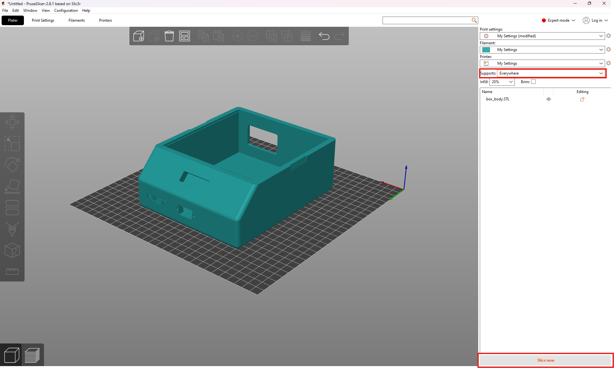

# Temperature Control
System for controlling temperature of an object to within 1 mK of a given setpoint.

## Setup

### Recommended installations
Before starting setup, there is software that is necessary to access some of the files in this repository:
* [Arduino IDE](https://www.arduino.cc/en/software/): Edit and upload Arduino code
* [KiCAD](https://www.kicad.org/download/): View and export PCB files
* [Prusa Slicer](https://www.prusa3d.com/page/prusaslicer_424/): Convert STL 3D models to gcode for a 3D printer
* [Realterm](https://sourceforge.net/projects/realterm/): Send serial commands and save serial data from Arduino to text file

These programs can all be downloaded for free.

### Manufacturing

#### Shield PCB
The PCB files can be found at [Manufacturing/Shield PCB](Manufacturing/ShieldPCB/). In order to get the manufacturing files, open the .kicad_pcb file and export according to what is necessary for your manufacturer of choice. If you don't have a manufacturer of choice, I recommend [JLCPCB](https://jlcpcb.com/). Once you have the board, assemble it according to the component labels in the .kicad_sch file. The complete list of necessary components can be found in the bill of materials.

#### Container (optional)
If you have access to a 3D printer, I recommend printing the container found in [Manufacturing/Box](Manufacturing/Box). This can be done by opening the .stl files in Prusa Slicer and converting them to gcode:

Then export the gcode file and give it to your 3D printer:

#### Temperature Probe
This system uses two temperature sensors: one for the feedback loop that controls the temperature in addition to a heater, and one for independent monitoring of the temperature with a sensor outside the feedback loop. Because the configuration of these sensors and the heater will depend on the form factor of the object being temperature controlled, there is no case for them in this repository, but there are requirements for how it is built. The temperature sensors should be two 10k thermistors in a voltage divider as shown below:

    

TEMP1 and TEMP2 are the two signal cables that will be connected to IN1 and IN2 on the shield, REF comes from the REF pin on the shield and is generated by the on-board 2.5V voltage regulator, and GND comes from one of the GND pins on the shield. Additionally, a heating resistor connected to the R6 pin header should be placed near the object being temperature controlled. If you're using the optional container, all of the wires in your case should be connected to a d-sub 9 connector so they can be plugged into the container. Some additional recommendations for configuration of the probe:

* Try to thermally isolate the sensor-heater-object system as best as you can with the case that you build. This will have the largest effect on the performance of the system.
* Place the temperature sensors far from the heater. This will ensure that you're measuring the actual temperature of the object, not just the temperature of the heater.
* Don't place the sensors too close to each other so you can see on the independent sensor if the object is being heated unevenly.
* Try to match the resistors in the voltage dividers as best as possible. This will ensure that the voltage you measure on both dividers is the same as long as the temperature is the same.

Because the performance is largely dependent on the probe setup, there are no guarantees that you will get mK-level stability if it isn't good enough. However, below you will find tools to assess the performance and potential flaws of your setup so you can iterate your design until it is good enough.

### Assembly
Connecting the shield PCB to the Arduino is very simple: just align the pins coming from the underside of the PCB with the input pins of the Arduino and connect them directly so the PCB is sitting on top of the Arduino. There should be an exact one-to-one match between PCB pins and Arduino pins. If you're using the optional container, use the following images as a reference to place the components within it correctly.

Box front:

    

Box back:

    

Box top:

    

Use the following wiring diagram to make the necessary connections:

    

WARNING: THE WALL PLUG CARRIES HIGH VOLTAGES WHEN CONNECTED. BE VERY CAUTIOUS WHEN WORKING WITH POWER CABLES AND DO NOT PLUG IN THE BOX UNTIL ALL THESE CABLES FROM THE POWER CONNECTOR ARE SHRINK WRAPPED AND THERE IS NO EXPOSED METAL. PLUGGING IN WITHOUT TAKING THE CORRECT PRECAUTIONS COULD CAUSE HARM.

### Code
The Arduino code makes use of two custom libraries: AD7190 for interfacing with the ADC on the shield and PID for handling the feedback loop of the system. These two folders can be found in [Code/Libraries](Code/Libraries) and can be installed using the following steps:

* Save both folders as a zip file
* Open the Arduino IDE and select Sketch > Include Library > Add .ZIP Library
* Navigate to the location where your libraries are saved and select them

The code to be uploaded to the Arduino is found in [Code/Arduino](Code/Arduino)

## Usage

### Serial commands
The Arduino accepts a variety of commands to interface with the PID system, which are summarized in the table below:
| Command          | Arguments accepted             | Description                                                                                                 |
|:-----------------|:-------------------------------|:------------------------------------------------------------------------------------------------------------|
| p \[arg1\]       | arg1: double > 0               | Change the Kp parameter of the PID system                                                        |
| i \[arg1\]       | arg1: double > 0               | Change the Ki parameter of the PID system                                                        |
| d \[arg1\]       | arg1: double > 0               | Change the Kd parameter of the PID system                                                        |
| heat \[arg1\]    | arg1: 0 or 1                   | Turn heater off (0) or on (1)1                                                                   |
| setp \[arg1\]    | arg1: double < 29              | Change the setpoint of the PID system                                                                       |
| verbose \[arg1\] | arg1: 0 or 1                   | Output control stats to serial port (see [Serial output](#serial-output))                                   |
| rstime           | none                           | Restart the timestamp at 0                                                                                  |
| sint \[arg1\]    | arg1: double                   | Set the integral term to a custom value2                                                         |
| save             | none                           | Save the current Kp, Ki, Kd, and setpoint to EEPROM3            |

1 This is implemented in practice by multiplying the heater output by arg1, so passing any other number will have the effect of changing the gain of the entire system

2 Due to the anti-windup, if |arg1| > 10, it will be set to either -10 or +10

3 Arduino variables are stored in program memory while a program is running which is volatile, meaning it is lost when the Arduino loses power. However, the Arduino also has a non-volatile form of data storage called EEPROM, so if you want to move your controller and disconnect power you won't lose the parameters you found during tuning. This memory has a limited number of write cycles though, so use this command sparingly.

In order to ensure the commands are received correctly, they should be sent a couple times in quick succession because the Arduino only listens on the serial port when it's not performing other calculations.

### Serial output

When verbose is set to true, data is output to the serial port in the following format:

**Timestamp &nbsp;&nbsp;&nbsp; Temperature voltage &nbsp;&nbsp;&nbsp; Independent sensor reading &nbsp;&nbsp;&nbsp; Error voltage &nbsp;&nbsp;&nbsp; Proportional term &nbsp;&nbsp;&nbsp; Integral term &nbsp;&nbsp;&nbsp; Derivative term &nbsp;&nbsp;&nbsp; Output power &nbsp;&nbsp;&nbsp; Output voltage to heater circuit**

### Tuning
DISCLAIMER: This is not necessarily the optimal tuning method, but just the one that I found works best for me. If you have another method that you prefer and you know it works better, go ahead and use it. This is just for a beginner to get a feel for tuning.

NOTE: There is a [jupyter notebook](Code/Data%20Analysis/data_analysis.ipynb) in Code/Data Analysis that can be used to help with tuning. If you would like to use your own analysis techniques, it is not required to use this notebook, however if you have your own analysis techniques in addition to those found in the notebook, you probably don't need this section anyway.

The notebook has 3 main cells that will be useful. The first one, third from the top, will just take your data and plot everything from the serial output on it's own axis for the entire dataset. This can be used to look at your data wholistically and to analyze long term stability. The next cell from the top will plot the last 150 seconds of data, and updates every second. This can be used if you want to see live-updating data and catch any large errors before having to wait to see everything at once. The last one is the PSA spectrum of the P, I, and D terms of the controller and the temperature data. This essentially shows you how much of each frequency is contained in the data, which is useful for reasons explained below.

#### Step response
When tuning, you will want to look at the step response of your system, which is just how it responds to an instantaneous change in the setpoint (In this case, moving it up). Do this by turning off the heater, waiting for the temperature to return to room temperature, then sending the command "sint 0" and turning the heater back on. The step response will be the temperature graph after turning the heat back on.

#### Recognizing issues
Once you get to the point of tuning the parameters of the system, you want to make sure the probe setup is good enough, because otherwise you're limited by the quality of your setup instead of the accuracy of the parameters. The main issue that you will run into with the probe setup is insufficient thermal isolation, which means surrounding air temperature is being factored into your measurement. Generally, the object being temperature controlled will have a much larger thermal mass than the surrounding air, so watch for large, quick changes in temperature. A normal time period for a temperature change depends on your thermal mass, but will typically be on the order of a couple minutes. If you see relatively large temperature changes happening in a matter of seconds, it's probably a probe issue rather than a parameter issue.

#### Step 0: The basics
Before starting, a general overview of PID. PID stands for proportional, integral, derivative, and controls a system using exactly those things. It takes as input the error between the setpoint and the actual temperature and outputs the negative sum of the integral of the error, derivative of the error, and exact error all scaled by constants, called the gains. The proportional term just pushes the temperature towards the setpoint. This might be enough in some cases, but think about what would happen if the error were 0 and the temperature was above room temperature. A controller with only the proportional term would not be doing anything to keep the temperature above room temperature because K*0 = 0 so it would output 0. This means any controller with only the proportional term will have some steady state error. This is where the integral term comes in. If there is any steady state error, the integral term will accumulate over time, pushing the temperature towards the setpoint. The speed that it accumulates is dictated by the integral gain. Notably, too high of a proportional gain or integral gain will cause oscillations, which are not what we want. This is where the derivative term comes in. It can be thought of as predicting the future; if the derivative is positive, the temperature will probably go up, and so the derivative term preemptively reduces the output power to reduce this change. Such a term will provide damping of oscillations, and that is its job.

#### Step 1: Picking a setpoint
Before doing any tuning, figure out the ambient temperature of the object being temperature controlled using the system. The system guarantees high precision, but not high accuracy, so doing this will give you a frame of reference for what the temperature actually is. Once you've done this, set the setpoint. It can be whatever you want but is bounded on both sides by two factors: the bottom end is about 2-3 oC above room temperature since the system has no cooler so ambient temperature is used to cool it, and the upper end is limited by your heater's power output. This depends on the resistance of the heater and the input voltage that you use (12V if you use the optional container with no modifications).

#### Step 2: Finding proportional gain
The next step after setting the setpoint is to find Kp, the proportional gain of the system. To find the proportional gain, just pick a number to start. If the step response goes past the setpoint, reduce it by half until it doesn't. Then, slowly turn it up and watch the step response each time you change it. Once it is settling close to the setpoint, but slightly below, move on to step 3.

#### Step 3: Finding integral gain
First, cut your proportional gain in half, and then pick a number for your integral gain. It will probably be much smaller than the proportional gain you found. If the oscillations are centered above the setpoint while it settles, turn the integral gain down. If below, do the opposite. Once the oscillations are centered approximately at the setpoint, move on to the next step.

#### Step 4: Finding derivative gain
This step is pretty simple, just turn up the derivative gain until the oscillations are damped as much as is necessary for your purposes. The higher it is, the more damped they will be. If your derivative gain gets too high, the integral term might accumulate more than it was before because the derivative term slows the original ascent to the setpoint, so you'll need to turn down the integral gain slightly. Once you've finished finding the parameters, a good step response will look something like this:

#### Step 5: Fine tuning the parameters
The above steps help with the original settling to the setpoint, but in order to get the best steady state performance, the parameters need to be tuned a little more. To do this, take about 12 hours of data after the temperature has settled and look at the PSA spectrum. An ideal spectrum will look like this:

    

Note the integral term is the strongest at lower frequencies, then the proportional term takes over in the middle frequencies, and finally the derivative term takes over at high frequencies. It will also have two points where all terms will start to roll off: one is the natural frequency of your system; the temperature can't change any faster than that, and the other is due to a filter in the feedback loop. Just ignore these and look at the general shape. If the shape doesn't look like this, you can move each term up by multiplying it by a scaling factor, and move it down by dividing by a scaling factor. Scale the parameters appropriately and they should then be optimal.